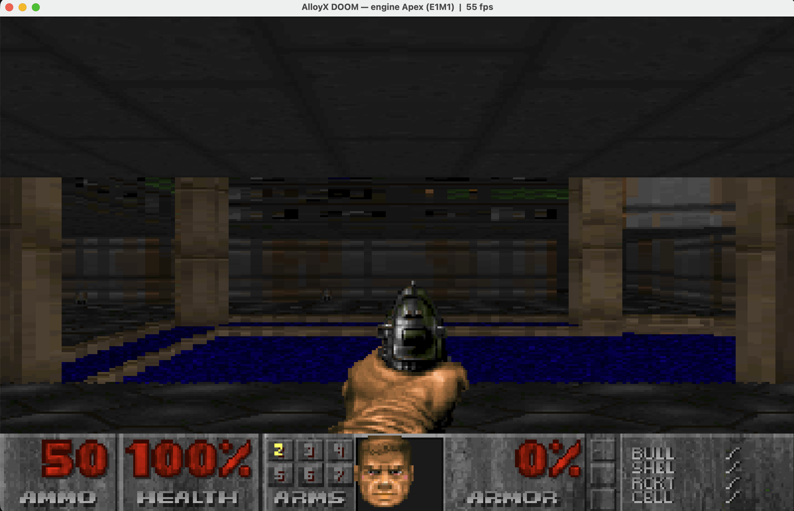

# AlloyX DOOM — *can it run DOOM?*

[English](README.md)

**Sim, e é jogável.** Este projeto recria a experiência de DOOM com um **engine escrito em Apex**:
parser de WAD, matemática fixed-point e renderizador por software. O [AlloyX](https://github.com/colatusso/alloyx)
transpila o código Apex para Java, que é compilado para a JVM e roda **em tempo real numa janela**
(gráfico, colorido, ~60 fps) com teclado.

Os mapas **E1M1 (Hangar)** e E1M2 são preparados a partir de uma cópia oficial do `DOOM1.WAD`
fornecida pelo usuário (shareware id Software, `md5 f0cefca49926d00903cf57551d901abe`)
antes de serem carregados pelo engine Apex.



## Jogar (gráfico, tempo real)

Requer JDK, Python 3, `allx` no `PATH` e o projeto `apex-local` compilado na pasta irmã.
Coloque uma cópia legítima do `doom1.wad` shareware nesta pasta. O WAD e o
`WadData.cls` derivado dele não são distribuídos neste repositório; o primeiro
`./play.sh` gera `WadData.cls` automaticamente.

```bash
./play.sh
```

Compila o engine Apex → `.class` (via `allx`), compila o host Java e abre a janela.

**Controles:** `W`/`S` frente-trás · `A`/`D` ou setas viram · `Q`/`E` strafe · `Ctrl` atira ·
`SPACE` **usa/abre porta/alavanca** · `2`-`7` troca arma · `TAB` automap · `ESC` sai.

Monstros só **acordam** quando te veem de perto (linha de visão) e **erram** boa parte dos tiros —
dá pra jogar sem morrer toda hora. `TAB` mostra o mapa real do E1M1 por cima (confirma a fase).

Agora com **múltiplos níveis**: o **E1M1** e o **E1M2** lidos do `DOOM1.WAD`; a **alavanca de saída**
leva pro próximo mapa preservando **vida, armas e munição** (chaves resetam por nível, como no DOOM).

Loop de DOOM completo, tudo no engine Apex:
- **6 armas** (pistola, shotgun, chaingun, rocket, plasma, BFG — tabela data-driven lida do WAD):
  cada uma com **munição própria** (**balas/cartuchos/foguetes/células**), dano, cadência e som;
  troca com `2`-`7`, pega no mapa e acende no painel **ARMS**.
- **chaves** (azul/amarela/vermelha): **portas trancadas** só abrem com a chave certa (senão "no way").
- **portas** que abrem com `SPACE` (anima o teto), **colisão de altura** (degrau alto/porta fechada
  bloqueiam) e **câmera que sobe/desce** acompanhando o chão de cada setor.
- **plataformas/lifts** (acionados ao pisar na linha), **alavanca de saída** (`SPACE` na parede) e
  pisos que baixam — via tags reais do WAD (cruzamento de linha + setor por tag).
- **pickups reais** do E1M1: armas, balas, cartuchos, vida, armadura (efeito por tipo, lido do WAD).
- **29 monstros** (zombieman, shotgun guy, imp) com **8 ângulos de visão** (você vê de frente, de lado
  ou de costas conforme circula): **perseguem**, **animam ao andar**, **atiram de volta** (com pose de
  tiro), o **imp lança bola de fogo** (projétil que voa) e **morrem com animação de queda** → viram corpo.
  Zombieman **dropa clip** (5 balas) e shotgun guy **dropa a shotgun** ao morrer, igual no DOOM.
- **vida do player** + **respawn** ao morrer; **flash vermelho** ao tomar dano.
- **HUD fiel**: barra **STBAR** real do WAD, com munição, vida `%`, armadura `%`, painel
  **ARMS** (arma 2 acesa) e o **rosto do Doomguy que se machuca conforme a vida** (5 níveis).
- **render de setores** (portal walker): altura real de chão/teto por setor → **degraus**,
  **batentes de porta**, **molduras de janela** e **céu** nas áreas abertas — a cara do E1M1.
- **som**: SFX reais do WAD (tiro, porta, pickup, dano, monstros) decodificados de DMX→PCM no
  engine Apex; e a **música do E1M1** (MUS→MIDI no gerador) tocada em loop. O engine só **enfileira
  os eventos**; o host Java toca (áudio = I/O, igual ao blit do framebuffer).
- paredes/degraus **texturizados** (upper/lower/middle reais) + **chão/teto por setor** (flats reais,
  cast com perspectiva) + **luz por setor**; sprites com oclusão por zbuffer.

Janela **1200×750 redimensionável** (arraste/maximize). Resolução interna 400×250 estilo DOOM.

### Engine Apex, host Java

`Doom.cls` é **100% código-fonte Apex**, sem Java embutido nem renderizador 3D em Java. Ele implementa
movimento, colisão, combate, monstros, renderização por software e o framebuffer RGB retornado por
`stepFrame(cmd)`. `Wad.cls` também é Apex e interpreta os dados do WAD gerado. A 320×200, o engine
roda internamente a aproximadamente 2.000 fps; o loop da janela limita a 60 fps.

`Game.java` fornece a janela, recebe o teclado, exibe cada frame, controla o tempo e reproduz o áudio.
O gerador Python prepara os recursos do WAD do usuário antes da execução. Isso **não diminui o trabalho
em Apex**: o host não calcula as regras do jogo nem renderiza a cena 3D. A afirmação de 100% Apex se
refere ao **código-fonte do engine**, não ao programa desktop inteiro nem à execução dentro de uma org Salesforce.

### Por que não roda "puro pelo `allx run`"?
`allx run` é **one-shot** (executa um método e sai) e só escreve **texto** no stdout — não tem loop de
input nem saída gráfica, e cada chamada custa ~0,5s. Tempo real é impossível assim. A solução fiel ao
AlloyX ("seu Apex roda como Java na JVM"): **transpila o engine Apex uma vez** e roda num host de
tempo real. A lógica do jogo continua em Apex; janela, teclado, exibição e áudio ficam no host Java.

## Bônus — o mesmo engine Apex via `allx run` (modo texto)

```bash
allx run Doom.cls --method Doom.automap   # mapa top-down do E1M1 (prova a geometria real)
allx run Doom.cls --method Doom.fpv       # 1 frame first-person em ASCII
allx run Doom.cls --method Doom.demo      # walkthrough autônomo (160 frames) em ASCII
./run.sh                                  # toca o walkthrough ASCII animado no terminal
```

## Como funciona

```
DOOM1.WAD (oficial)
  │  tools/wad2apex.py  (Apex não tem file I/O → este gerador faz o papel de "Static Resource")
  ▼
WadData.cls            PWAD mínimo do E1M1 (THINGS/LINEDEFS/SIDEDEFS/VERTEXES/SECTORS + LUT de seno)
  │                    embutido em base64 chunkado (< limite de 64KB do literal Java)
  ▼
Wad.cls   (Apex)       parser REAL de WAD: header → directory → lumps; decode base64; LE int16/int32
  ▼
Doom.cls  (Apex)       PORTAL WALKER: por coluna atravessa os linedefs reais em ordem de
  │                    distância, desenha chão/teto na altura real do setor + degraus
  │                    (upper/lower) + céu; TEXTURAS reais (PLAYPAL + TEXTURE1/patches +
  │                    flats); grid p/ colisão; init()/stepFrame(cmd) → framebuffer RGB
  ▼
allx (transpile+javac) Apex → Java compilado em .apexcache/*.class
  ▼
Game.java (host)       JFrame + BufferedImage + teclado; chama stepFrame() a 60fps e faz o blit
```

O `Wad.cls` parseia o WAD de verdade e bate com o ground-truth do E1M1:
**467 vertexes, 475 linedefs, 648 sidedefs, 85 sectors, player start (1056, −3616, 90°).**

## Restrições do runtime contornadas (engine em Apex puro, via AlloyX)

| Limitação | Solução |
|---|---|
| Sem file I/O / `Blob` / `EncodingUtil` usável | `wad2apex.py` embute os bytes do WAD em base64; `Wad.decodeB64` decodifica em Apex |
| Sem `Long` (sem literais `L`, sem widening Integer→Long) | Tudo `int` 32-bit; direção do raio em escala `/256` mantém os produtos cruzados < 2.1e9 (sem overflow) |
| Identificadores **case-insensitive** (Apex) | Local não pode colidir com campo/constante (`s` vs `S=16384`, `gW` vs `gw`). Pior caso: **contador de `for`** — transpila `for (var s=1; S<steps; S++)` e o loop nunca roda. Em expressão comum costuma resolver certo, mas a regra é **nunca colidir** (renomear: `si`, `ls`, `gunW`) |
| Sem `Math.sin/cos/sqrt` (só `mod/abs/min/max/round/random`) | **LUT de seno** (1024 amostras ×16384) embutida como lump `SINE` no WAD; `isqrt` por Newton |
| Sem bitwise/shift (`<<`, `>>`, `&`, `%`) | Aritmética pura (`*64`, `/`, `Math.mod`) |
| `String.charAt` retorna `char` (não `Integer`) | `s.charAt(i) + 0` força a promoção pra int |
| Locais são `var` (Java infere o tipo) | RHS sempre inteiro pra evitar `Decimal` (literais `2.0` viram `Decimal`) |
| Modo texto: `'\n'` não vira newline | 1 scanline por `System.debug`; `run.sh` tira o prefixo `DEBUG\|` |

## Regenerar `WadData.cls` (ou trocar de mapa / WAD)

```bash
python3 tools/wad2apex.py doom1.wad E1M1,E1M2 --out WadData.cls
```

`doom1.wad` é o shareware oficial. O gerador também aceita outro IWAD/PWAD
fornecido localmente e extrai os mapas disponíveis; o `Wad.cls` parseia normalmente.

## Arquivos

- `Doom.cls` — raycaster + API gráfica (`init`/`stepFrame`) + automap + walkthrough ASCII (Apex)
- `Wad.cls` — parser de WAD + decode base64 + leitura LE (Apex)
- `WadData.cls` — **gerado localmente, fora do Git**: PWAD dos mapas em base64
- `Game.java` — host Java de tempo real (janela + teclado + blit + áudio)
- `play.sh` — compila tudo e abre o jogo
- `run.sh` — player do walkthrough ASCII no terminal
- `tools/wad2apex.py` — gerador (lê o WAD oficial → `WadData.cls`)
- `doom1.wad` — IWAD oficial shareware, fornecido localmente (fora do Git)

## Licença e marcas

O código deste projeto é distribuído sob **GPL-3.0-or-later**. Consulte
[LICENSE](LICENSE) e [NOTICE](NOTICE), que também atribui a adaptação do conversor
MUS→MIDI do Chocolate Doom. Isso é diferente do licenciamento do AlloyX,
que é um projeto separado.

DOOM e seus dados são de seus respectivos titulares. O WAD, gráficos, sons e
dados gerados a partir dele não fazem parte deste repositório. Este projeto
independente não é afiliado à id Software, Bethesda ou Salesforce.
